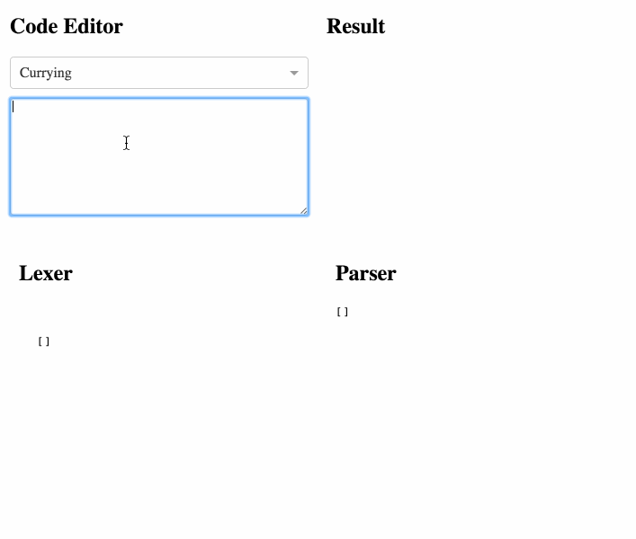
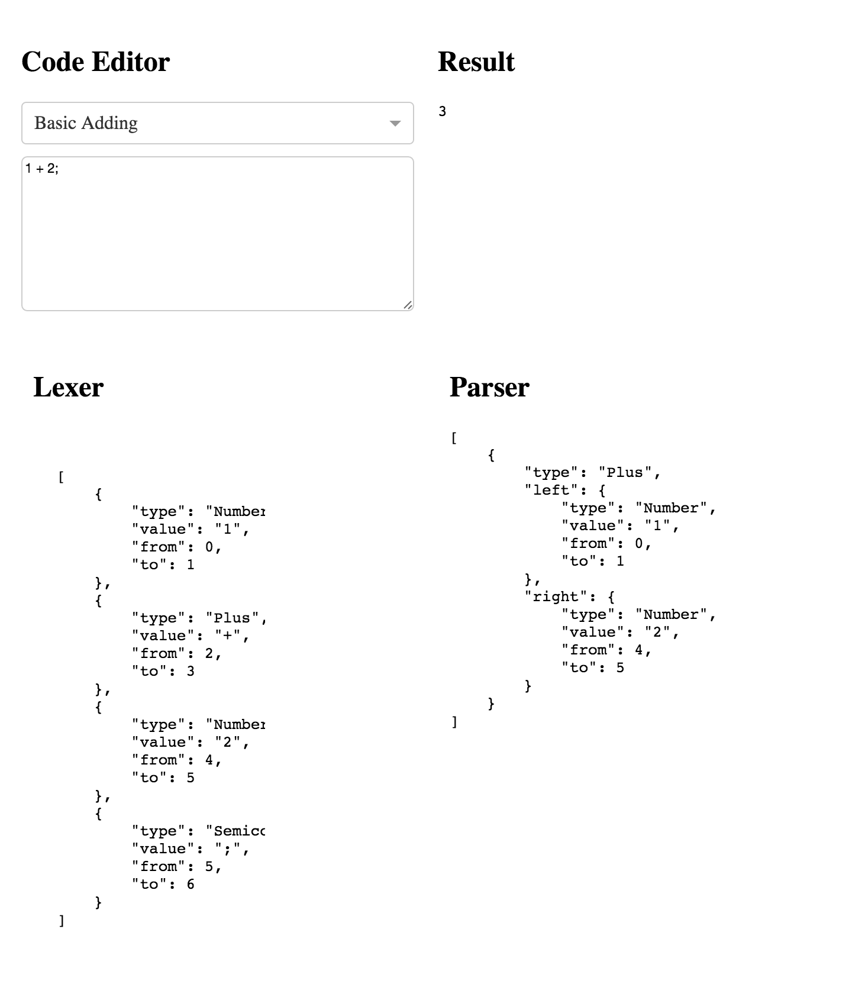
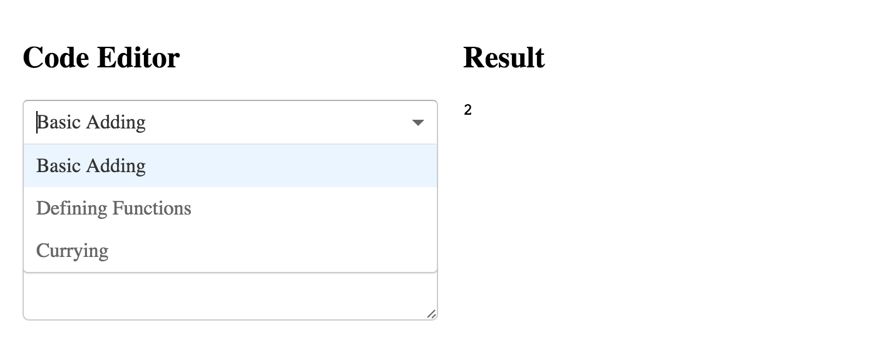
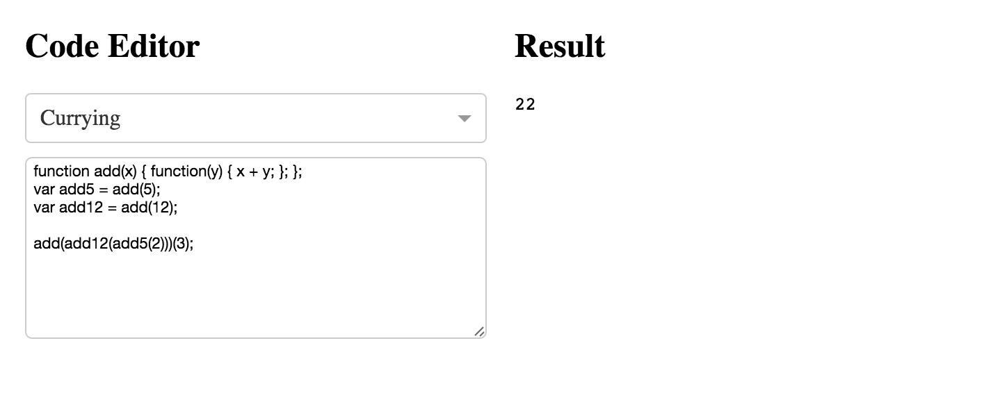
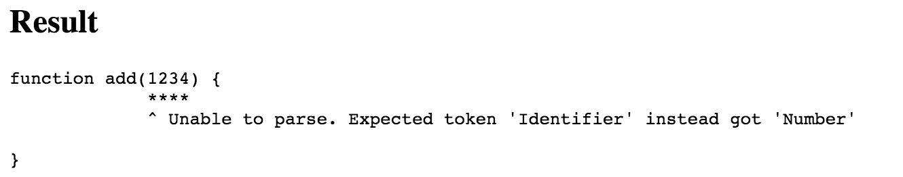

# js-compiler

This application investigates writing an intepreted language which can automatically be evaluated within the browser as the user types.

The application works as a basic REPL, with the front-end written in [React](https://facebook.github.io/react/).

## Overview

The stages of Lexing, Parsing, and Evaluating are all written in JavaScript. Each stage is shown in the application, purely for demonstration purposes.

## Examples

##### REPL

##### Basic Adding

##### Examples List

##### Functions + Currying

##### Error Highlighting
